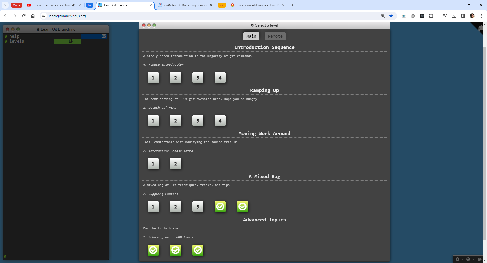
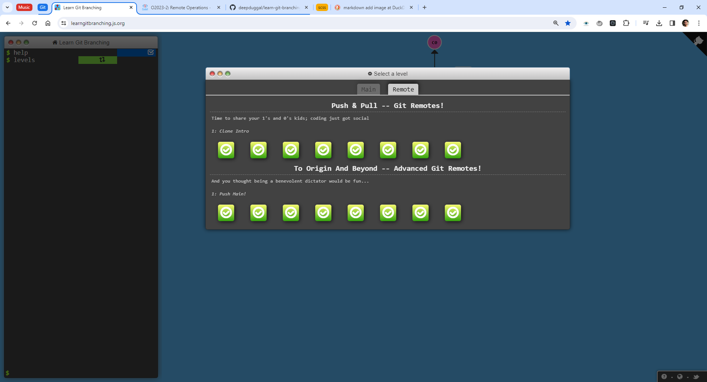
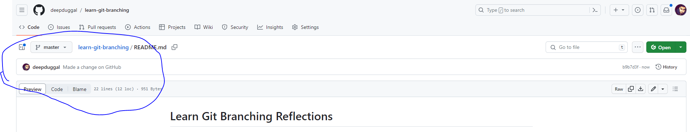
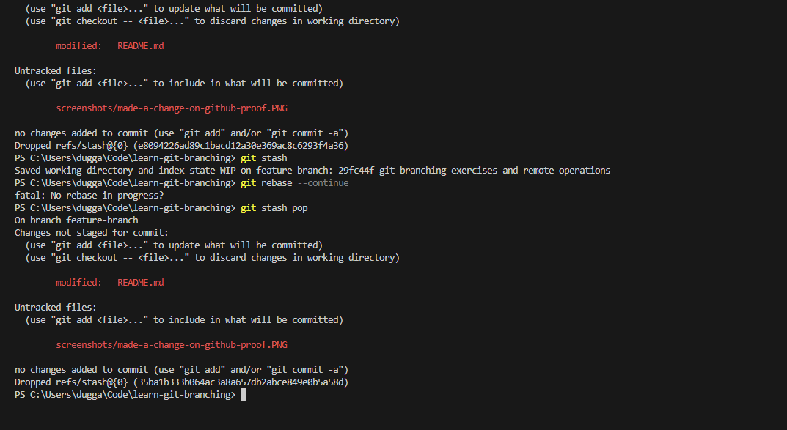
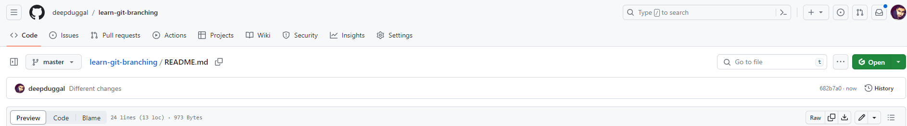
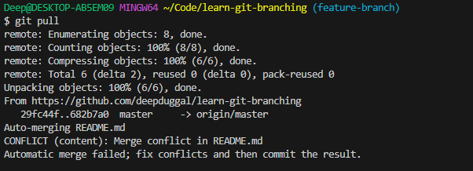
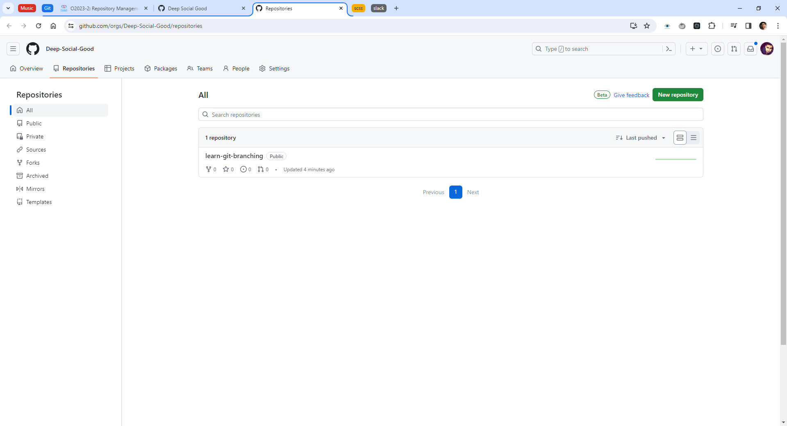

# Learn Git Branching Reflections

## Git Branching Basics

I reviewed git basics and got a better understanding of rebasing and various types of pointers to commits like HEAD and branches.

## Git Branching Exercises

Learned about git tags and git describe. The practice was closer to real-world practice this time.

## Remote Operations

Working with remotes in git is super easy.

## I made a change on GitHub.

## Different changes

## An uncommitted change?

## Some changes

## Git Rebase

It's much easier to resolve merge conflicts with the vs code merge conflict UI. There's a final result UI and a UI for each version of the document.

## Transfer to Organization

It was easier than expected. Just a few clicks. 

[https://github.com/Deep-Social-Good/learn-git-branching](https://github.com/Deep-Social-Good/learn-git-branching)

